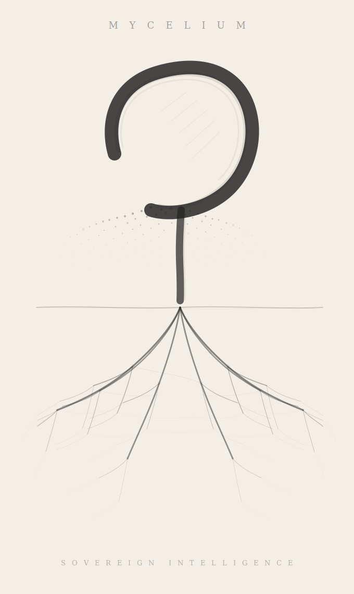

  

<h1 align="center">Mycelium</h1>

<i>The data layer for your digital life.</i>

A self-sovereign personal intelligence system. You own the keys, the data, and the intelligence.

---

## Status

**Pre-launch.** This repository will hold the redesigned, encryption-native Mycelium codebase.

Two specs live here:

- **[`docs/V1-BUILD-SPEC.md`](docs/V1-BUILD-SPEC.md)** — the **first thing we ship**: a self-hosted single-user MCP server (better-sqlite3 with a D1-compatible adapter, BIP-39 + AES-256-GCM at rest, OAuth 2.1 + Cloudflare Tunnel for remote, Ollama for local embeddings + BYOK cloud inference, 37 tools, AnalysisEngine plugin interface for the topology engine). **9–11 day build.** This is the AGPL sovereignty product.

- **[`docs/REDESIGN-LIVING-SPEC.md`](docs/REDESIGN-LIVING-SPEC.md)** — the **architecture-rationale spec**: 3 sweep rounds against the canonical production system (12 parallel Explore agents, ~12.8k words evidence), verification table, transfer/rebuild/discard matrix, RLS threat-model pressure test (5 HIGH severity findings), MYA-0.2 abandonment lessons, and the 18 operator decisions that gate the eventual managed-light multi-tenant Postgres build. V1's "Phase 5: Extensions" is what this spec covers in depth.

Sequencing: ship V1 first (the open-source promise), validate it with real users, then decide whether the managed-light V2 tier is worth the architectural complexity the redesign spec captures.

Until launch this repository is **private**. License is AGPL-3.0 (see [`LICENSE`](LICENSE)) — public release is planned to coincide with the V1 launch.

## Where things live

| Repo | Role | Status |
|---|---|---|
| **[mycelium](https://github.com/Curious-Life/mycelium)** (private) | Canonical production code — single-tenant, per-VPS, dedicated-tier customers (0mm, puh, marti, admin) | Active, live |
| **mycelium.id** (this repo, private) | Redesigned multi-tenant managed-light tier | Pre-launch, design phase |
| **mycelium-managed** (planned, private) | Operational scripts, fleet ops, ops-only secrets | Not yet created |

The dedicated-tier code in `mycelium` continues to serve existing customers. The managed-light Tier B will run from this repo when ready.

## Legacy state

This repo had a prior life as a stale open-source mirror (Feb–April 2026). That state is preserved at two immutable git tags:

- `legacy-2026-04-mirror` — what the `main` branch held before the v2 redesign wipe
- `legacy-energy-spores-2026-04` — the `energy-and-spores` branch (energy ledger + spore framework experiment)

Documents harvested from those branches for v2 reference live under [`docs/legacy/`](docs/legacy/):

- `ARCHITECTURE-from-legacy.md` — the biological-model framing (mycelium / forest / spores / strain)
- `SOCIAL-SHARING-SPEC-from-legacy.md` — Phase 1–5 federation + connection-mindscape + discovery + SMPC design
- `ENERGY-from-legacy.md` — token-budget metabolic-state cost-router design (becomes the basis for Tier B's cost router)
- `MINDSCAPE_DESIGN-from-legacy.md` — topology UI design
- `SPORES-FRAMEWORK-from-legacy.md` — plugin architecture (deferred until post-launch use case)

## Build sequence

Phasing in [`docs/REDESIGN-LIVING-SPEC.md` § Part 10](docs/REDESIGN-LIVING-SPEC.md):

| Phase | What | Estimated |
|---|---|---|
| 0 | Pre-redesign cleanup (20 ship-before docs in canonical repo) | 3–5 wk |
| 1 | Tier B foundation: Postgres + RLS + connection middleware + key-wrap + agent runtime | 6–9 wk |
| 2 | Tier 2 launch: 2–5 hand-picked users | 2–3 wk |
| 3 | Scale to 20 users | 4–8 wk |
| 4 | Federation Phase 1 + native app | post-launch |

Realistic Tier 2 launch: Aug–Sep 2026.

## License

[AGPL-3.0](LICENSE). The intent is for the full Mycelium core to be open at launch; until then, this repo is private to avoid signaling a half-finished design.
